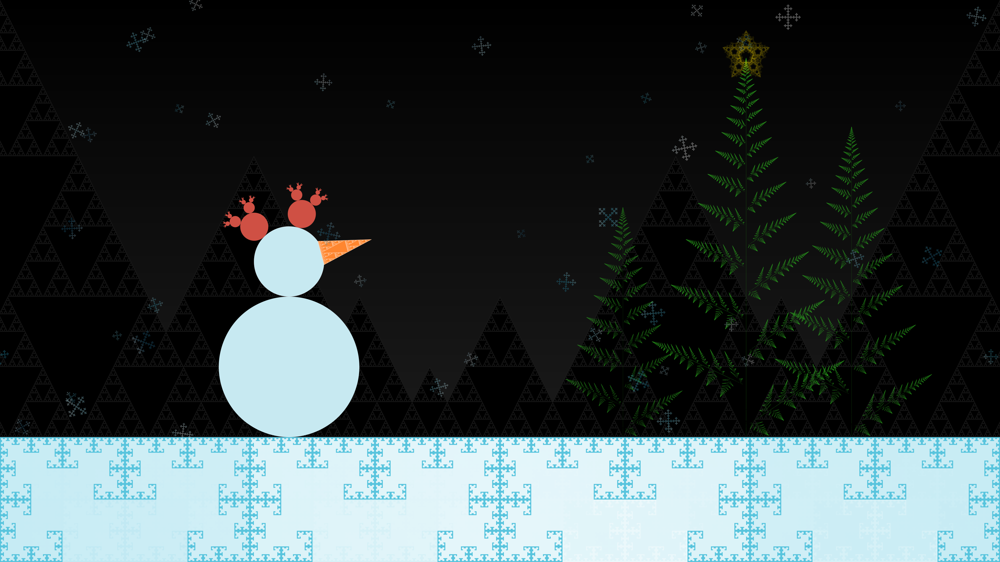

# Christmas Fractals
This project is my submission for the "Frosted Fractals" competition held by "The Mandlebrot Set", IIT Palakkad.

The final scene is set during night, with distant black mountains and cold, snowy ground because of the light snowfall. The snowman on the right looks at the brightly shining golden star on top of one of the christmas trees.

## Steps to recreate the scene
1. Download the repository as a `.zip` file.
2. The requirements are mentioned inside the `requirements.txt` file.
3. I recommend using `Python 3.10.12` as the Python interpreter.

_You may choose to install the dependencies however you wish. You can follow the steps below if you want to set them up inside a Python Virtual Enviroment using VSCode._

4. Bring up the VSCode command palette using: `CTRL` `SHIFT` `P` key combination.
5. Search and select: `Select: Python Interpreter`.
6. Select: `Create Virtual Environment`.
7. Select: `Venv`.
8. Select: `Python 3.10.12` (or any other python version which you are sure the code would run on).
9. Select: `requirements.txt` as the dependency file.
10. VSCode should automatically create a Python Virtual Environment for the selected version containing the required Python libraries.
11. If the above step doesn't work, after the Virtual Environment is created, run: `pip3 install -r requirements.txt`
12. After the Virtual Environment is created, run: `make`
13. The `makefile` should run. The program will take about 3-4 minutes to run, depending on the machine specifications.
14. The output file would be displayed once `Manim` renders the Scene. The file can be viewed manually under: `<path/to/base>/media/images/main/`

# Final Image
The snowflakes are generated randomly, hence, the scene generated by you may not match this one exactly.

